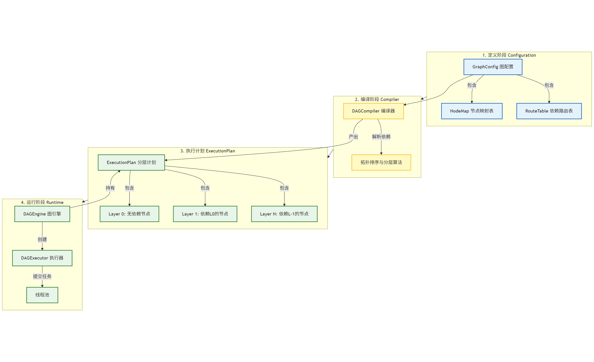
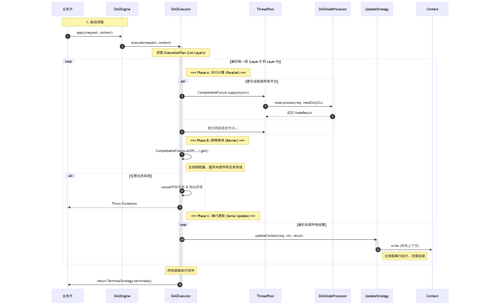
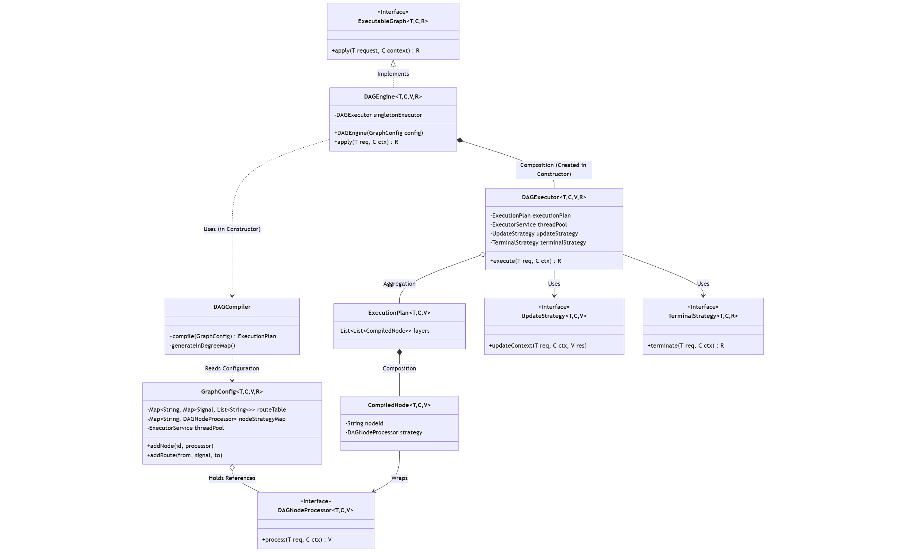
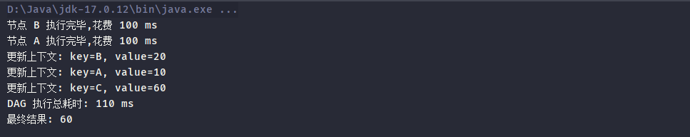
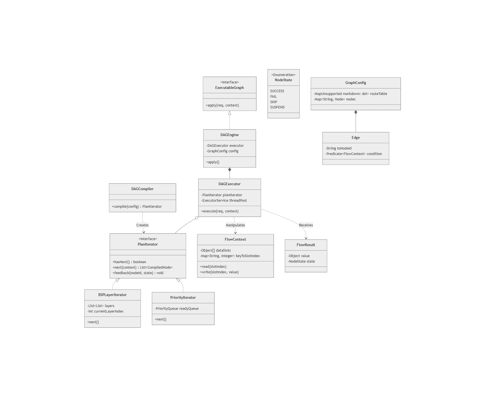
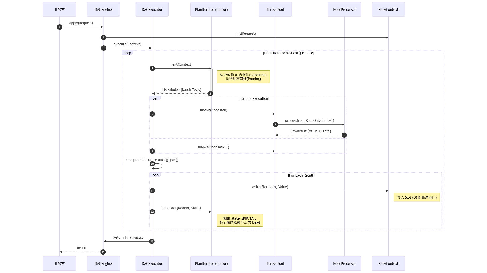

# DAGFlow

🚀 **A High-Performance DAG Execution Engine based on BSP Model**

DAGFlow 是一个轻量级、高性能的**有向无环图（DAG）执行引擎**。它基于**最长路径分层算法**构建，采用 **BSP（Bulk Synchronous Parallel）** 并行计算模型，能够自动分析任务依赖关系，最大限度地并行执行任务。

专为**复杂业务流程编排、微服务并行聚合、数据处理流水线**等场景设计。

---

## ✨ Features (核心特性)

* **自动并行化 (Auto-Parallelism)**: 基于拓扑排序和最长路径算法，自动将图分层，同层节点全并行执行。
* **BSP 执行模型 (BSP Model)**: 采用 `Compute` -> `Barrier` -> `Update` 的循环模式，确保数据一致性。
* **线程安全上下文 (Thread-Safe Context)**: 创新的“只读执行，串行更新”机制，彻底消除并发写锁竞争。
* **零侵入设计 (Non-Intrusive)**: 业务逻辑通过 `DAGNodeProcessor` 接口与引擎解耦。
* **环路检测 (Cycle Detection)**: 编译期自动检测循环依赖，防止运行时死锁。
* **完善的异常处理**: 超时、中断、节点异常捕获与根因分析

---

## 📐 Architecture (架构设计)

DAGFlow 的设计遵循**编译期与运行期分离**的原则。

### 1. System Topology (系统拓扑)

引擎分为 **Definition (定义)**、**Compiler (编译)**、**Plan (计划)**、**Runtime (运行)** 四个层次：



1.  **GraphConfig**: 开发者定义节点（Node）和边（Route）。
2.  **DAGCompiler**: 解析依赖关系，计算入度（In-Degree），执行拓扑排序。
3.  **ExecutionPlan**: 将图转化为层级结构（Layers），这是引擎的“作战地图”。
4.  **DAGEngine**: 根据执行计划调度任务。

### 2. Execution Flow (执行时序)

DAGFlow 的核心是 **BSP (Bulk Synchronous Parallel)** 模型的落地实现。这就好比一个组织严密的军队，按梯队推进：



* **Phase A (Parallel Compute)**: 处于同一层级（Layer）的所有节点被提交到线程池并行执行。此时 Context 是**只读**的。
* **Phase B (Barrier)**: 主线程等待当前层所有任务完成（`CompletableFuture.allOf`）。
* **Phase C (Serial Update)**: 所有任务完成后，主线程串行执行 `UpdateStrategy`，将结果合并回 Context。**这使得用户无需处理复杂的线程同步问题。**

### 3. Detailed Call Chain (调用链路)

从客户端发起请求到最终结果返回的完整生命周期：



---

## 🛠 Installation (安装)

### Maven
*将代码 clone 到本地并安装*：
```bash
git clone https://github.com/H-Mr/DAGFlow.git
cd DAGFlow
mvn clean install
```
*在项目中引入依赖*：
```xml
<dependency>
    <groupId>hjw.dev</groupId>
    <artifactId>DAGFlow</artifactId>
    <version>1.0-SNAPSHOT</version>
</dependency>
```

---
## ⚡ Quick Start (快速开始)
假设我们需要计算 (ValueA + ValueB) * 2，其中 A 和 B 是耗时任务，可以并行执行。
### 1. 定义数据包装类

```java
// 用于每个结点发送给执行器更新上下文
 @Data
    @AllArgsConstructor
    static class NodeResult {
        private String key;
        private Integer value;
    }
```
### 2. 定义DAG计算节点
```java
  // 节点 A: 模拟耗时操作，返回 key="A", value=10
DAGNodeProcessor<String, Map<String, Object>, NodeResult> nodeA = (req, ctx) -> {
    Thread.sleep(100);
    System.out.println("节点 A 执行完毕,花费 100 ms");
    return new NodeResult("A", 10);
};

// 节点 B: 模拟耗时操作，返回 key="B", value=20
DAGNodeProcessor<String, Map<String, Object>, NodeResult> nodeB = (req, ctx) -> {
    Thread.sleep(100);
    System.out.println("节点 B 执行完毕,花费 100 ms");
    return new NodeResult("B", 20);
};

// 节点 Sum: 依赖 A, B，计算 (A+B)*2
DAGNodeProcessor<String, Map<String, Object>, NodeResult> nodeSum = (req, ctx) -> {
    int a = (int) ctx.get("A");
    int b = (int) ctx.get("B");
    return new NodeResult("C", (a + b) * 2);
};

```
### 3. 配置图并运行
```java
public class Demo {
    public static void main(String[] args) throws Exception {
        
        // 1. 初始化线程池与配置
        ExecutorService threadPool = Executors.newFixedThreadPool(4);
        // 泛型定义: <Request, Context, NodeResult, FinalResult>
        GraphConfig<String, Map<String, Object>, NodeResult, Integer> config = new GraphConfig<>(threadPool);
        
        // 2. 注册节点
        config.addNode("nodeA", nodeA)
                .addNode("nodeB", nodeB)
                .addNode("nodeC", nodeSum);

        // 3. 建立依赖关系：A -> C, B -> C
        config.addRoute("nodeA", "nodeC");
        config.addRoute("nodeB", "nodeC");

        // 4. 配置全局策略 

        // 4.1 上下文更新策略：将 NodeResult 解析并写入 Context
        config.setUpdateStrategy((req, ctx, result) -> {
            System.out.println("更新上下文: key=" + result.getKey() + ", value=" + result.getValue());
            ctx.put(result.getKey(), result.getValue());
        });

        // 4.2 终结策略：从 Context 中获取最终结果
        config.setTerminalStrategy((req, ctx) -> {
            return (Integer) ctx.get("C"); 
        });

        // 5. 启动引擎
        DAGEngine<String, Map<String, Object>, NodeResult, Integer> engine = new DAGEngine<>(config);

        // 6. 执行
        Map<String, Object> context = new ConcurrentHashMap<>();
        long start = System.currentTimeMillis();
        Integer result = engine.apply("Request-001", context);
        long end = System.currentTimeMillis();
        threadPool.shutdown();
        System.out.println("DAG 执行总耗时: "+  (end - start) + " ms");

        System.out.println("最终结果: " + result); // Output: 60
    }
}
```
### 4. 运行结果



---
## 📝 License
*This project is licensed under the Apache-2.0 License.*

---
## 🌍 Production Practice (实战应用)

DAGFlow 并非仅停留在理论设计，它已在**高并发拼团交易系统**中得到实战验证。
在拼团业务中，**“锁单（Trade Lock）”** 也是一条极长的调用链路，涉及活动校验、风控扫描、用户限购检查、库存预占等。传统串行执行会导致 RT（响应时间）过长，影响用户秒杀体验。

### Case: Group Buying Trade Lock (拼团锁单链路)

我利用 DAGFlow 重构了锁单流程，将原本串行的 IO 密集型任务并行化。

#### 1. 业务流程编排
我们将锁单流程拆分为三个阶段（BSP 模型）：
* **Phase 1 (Parallel Check)**: 并行加载活动信息、查询用户限购次数、调用风控服务评估风险、加载当前拼团进度。
* **Phase 2 (Logic Decision)**: 所有数据就绪后，执行统一规则校验（`TradeCheck`），并调用价格试算服务（Nested DAG）。
* **Phase 3 (Persistence)**: 校验通过后，执行落库锁定。

#### 2. 代码示例 (Graph Configuration)
```java
// 详见 LockOrderDAGFactory.java
GraphConfig<TradeLockRequestEntity, TradeLockContext, TradeLockNodeResult, MarketPayOrderEntity> config = new GraphConfig<>(dagExecutor);

// 1. 注册节点 (Register Nodes)
config.addNode("loadActivity", loadActivityProcessor)       // 加载活动配置
      .addNode("riskControl", riskControlProcessor)         // 风控检测 (RPC)
      .addNode("loadUserCount", loadUserCountProcessor)     // 限购查询 (DB)
      .addNode("check", checkProcessor)                     // 规则校验
      .addNode("lockPersist", lockPersistProcessor);        // 落库

// 2. 编排依赖 (Orchestration)
// Level 1: 并行执行耗时操作
config.addRoute("loadActivity", "check");
config.addRoute("riskControl", "check");
config.addRoute("loadUserCount", "check");

// Level 2: 校验通过后落库
config.addRoute("check", "lockPersist");

// 3. 启动引擎
return new DAGEngine<>(config);
```
#### 3. 复杂场景支持
该实战案例还验证了 DAGFlow 处理复杂业务的能力：
　　
- Nested DAG (嵌套图): 在锁单流程中调用“营销试算”服务，而“营销试算”本身也是一个基于 DAGFlow 编排的独立图。

- Transaction Management: 配合 Spring 的事务机制，在 TerminalStrategy 或最终 Node 中处理事务提交。

🔗 相关项目: 关于该拼团系统的源码、详细业务架构图，请移步至演示仓库：[拼团交易平台](https://github.com/H-Mr/group-buy-platform.git "GroupBuyPlatform")

---

## 🚀 Future Roadmap (演进规划)

为了适应更复杂的业务场景（如风控决策树、动态规则编排），DAGFlow 计划在后续版本中进行架构升级，重点增强引擎的**动态性**与**可扩展性**。我们将从**数据协议**、**调度解耦**、**动态编排**三个维度进行重构。

### 1. Evolved Architecture (演进后架构)

为了打破 `DAGExecutor` 与 `ExecutionPlan` 的强耦合，将引入 **Iterator Pattern (迭代器模式)** 重构调度层，并标准化数据交互协议。



* **Decoupled Scheduler (调度解耦)**: `DAGExecutor` 不再持有静态的层级列表，而是通过 `PlanIterator` 动态获取任务。这意味着引擎可以轻松扩展支持 "优先级调度"、"流式调度" 等多种模式。
* **Standardized Protocol (标准化协议)**:
    * **FlowContext (Slot Model)**: 引入基于“槽位”的高速上下文，替代 `Map` 查找，提升高并发读写性能。
    * **FlowResult (Stateful)**: 节点返回状态 (`SUCCESS`, `SKIP`, `SUSPEND`)，从而支持复杂的控制流。

### 2. Dynamic Execution Flow (动态执行流)

演进后的引擎将支持 **Runtime Pruning (运行时剪枝)** 和 **Feedback Mechanism (反馈机制)**，实现真正的动态图执行。



* **Dynamic Fetch (动态拉取)**: 在 `Fetch` 阶段，迭代器根据当前 Context 动态计算边条件 (Edge Predicate)。如果不满足条件，后续依赖节点将被自动剪枝 (Pruning)，不再提交给线程池。
* **Feedback Loop (反馈闭环)**: 节点执行结果会反馈给迭代器，迭代器据此决定是否跳过后续整个分支（例如：某节点返回 `SKIP`，其所有后继节点自动标记为 Dead）。

### 3. Key Features (规划特性详情)

* **Condition & Predicate**: 支持在定义边时绑定 `Predicate<Context>`，实现 "如果不满足某条件，则不执行该分支" 的逻辑。
* **Event-Driven Trigger**: 从单纯的层级依赖进化为事件订阅模式，支持更灵活的异步编排。
* **Observability**: 内置 OpenTelemetry 支持，为每个 Slot 读写和节点执行注入 Trace，实现全链路可视化。
### 4. Observability (可观测性增强)
* **Trace Integration**: 内置 OpenTelemetry 支持，为每个节点执行注入 `TraceID` 和 `SpanID`，实现全链路可视化追踪。
* **Metrics**: 暴露 Prometheus 指标（节点耗时 TP99、层级等待时间、吞吐量），便于监控系统集成。

